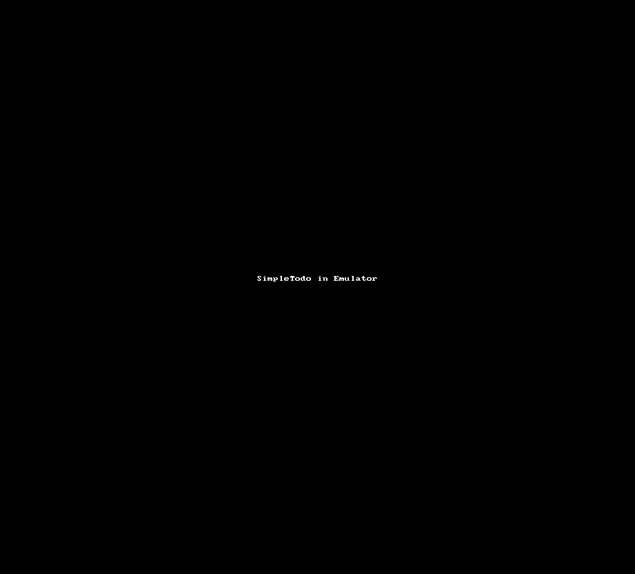

# SimpleTodo App

**SimpleTodo** is an android app that allows building a todo list and basic todo items management functionality including adding new items, editing and deleting an existing item.

Submitted by Robert M. Vunabandi  

Time spemt: from 1:00PM to 4:00PM, that is about **3 hours**.

## User Stories

The following **required** functionality is completed:

* [X] User can **view a list of todo items**
* [X] User can **successfully add and remove items** from the todo list
* [X] User's **list of items persisted** upon modification and and retrieved properly on app restart

The following **optional** features are implemented:

* [ ] User can **tap a todo item in the list and bring up an edit screen for the todo item** and then have any changes to the text reflected in the todo list

The following **additional** features are implemented:

* [ ] Click on a delete cross to delete instead of long press (which I thought was a bit annoying)
* [X] Show a message on delete
* [ ] Add priorities
* [ ] Add sub lists

## Video Walkthrough

GIF walkthrough is actually located in /demoGIT.gif 

GIF created with [LiceCap](http://www.cockos.com/licecap/).

A phone video is also in [demo.mp4](demo.mp4)

## Notes

Understanding how the android app works was a bit challenging, but it's very elegant even though it does not all make sense. For some reason, I tried to "System.out.println" one of variables with "R.string.stringName", but that did not work for some reasons. Otherwise, the app was fun to build.

## License

    Copyright [2017] [Robert M. Vunabandi]

    Licensed under the Apache License, Version 2.0 (the "License");
    you may not use this file except in compliance with the License.
    You may obtain a copy of the License at

        http://www.apache.org/licenses/LICENSE-2.0

    Unless required by applicable law or agreed to in writing, software
    distributed under the License is distributed on an "AS IS" BASIS,
    WITHOUT WARRANTIES OR CONDITIONS OF ANY KIND, either express or implied.
    See the License for the specific language governing permissions and
    limitations under the License.

